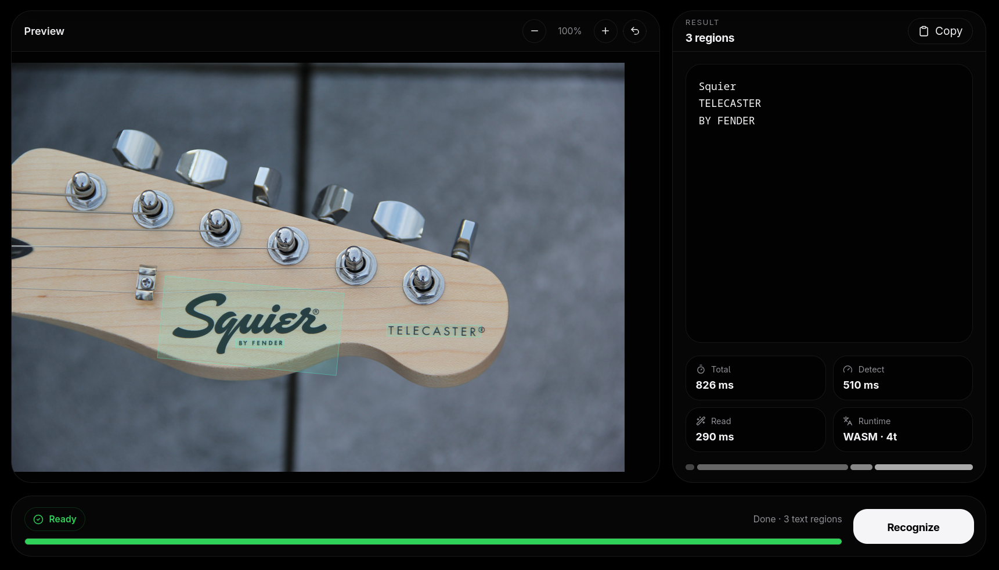
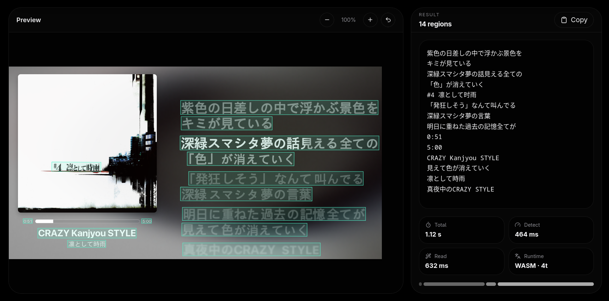

<p align="center">
  <a href="../README.md">English</a> ·
  <a href="README.ru.md">Русский</a> ·
  <strong>Čeština</strong> ·
  <a href="README.ja.md">日本語</a>
</p>

<div align="center">

# Glypho

**Rychlé vícejazyčné OCR s jádrem v Rustu.**<br>
Lokální ve výchozím nastavení, snadno vložitelné a dostupné z Rustu, Pythonu, Node.js i přímo v prohlížeči.

[](https://crates.io/crates/glypho-ocr)
[](https://pypi.org/project/glypho-ocr/)
[](https://www.npmjs.com/package/glypho-ocr)
[](../LICENSE)

</div>

<p align="center">
  
</p>

<p align="center">
  <a href="https://glypho.kaneki.cz"><strong>🌐 Vyzkoušet Glypho Web</strong></a>
</p>

Glypho je určené pro screenshoty, fotografie, text v UI a běžné OCR, kde chceš **dobrou přesnost bez odesílání obrázku do vzdáleného API**.

Nativní engine je napsaný v Rustu a používá ONNX Runtime s modely PP-OCR. Modely se stahují jen tehdy, když jsou potřeba, kontrolují se pomocí SHA-256 a ukládají se do lokální cache. Zahřáté detector/recognizer sessions zůstávají v paměti, takže další OCR nemusí znovu platit cenu za inicializaci.

---

## ⚡ Proč Glypho?

- **Nativní jádro v Rustu** — bounded decode, routing, batching, model store a orchestrace inference.
- **Vícejazyčné OCR** — 55 canonical BCP-47 identifikátorů pro latinku, East Slavic, čínštinu, japonštinu a korejštinu.
- **Local-first** — obrázky se zpracovávají lokálně; není potřeba účet ani API klíč.
- **Hardwarová akcelerace** — CPU, CUDA, CoreML a OpenVINO-aware buildy s fallbackem na CPU.
- **Warm inference** — jeden engine lze znovu používat pro více obrázků.
- **Jeden název balíčku** — `glypho-ocr` na Cargo, PyPI i npm.
- **Webová verze** — WebGPU + threaded WASM bez OCR backend serveru.

---

## 📦 Instalace

### Python

```bash
pip install glypho-ocr
```

### Rust

```bash
cargo add glypho-ocr
```

Pouze CLI:

```bash
cargo install glypho-ocr
```

### Node.js

```bash
npm install glypho-ocr
```

Python wheels a npm platform packages už obsahují nativní runtime. Uživatel **nepotřebuje Rust, Cargo ani ručně instalovaný `libglypho.so`**.

Modely se ve výchozím nastavení ukládají do:

```text
~/.glypho-ocr/models
```

Umístění lze změnit pomocí `GLYPHO_HOME` nebo `GLYPHO_MODELS`.

---

## 🚀 Rychlý start

### Python

```python
from glypho import Glypho

ocr = Glypho(
    languages=("cs", "en"),
    quality="balanced",
    device="auto",
)

ocr.warmup()
document = ocr.recognize("screenshot.png")

print(document.text)
```

### Node.js

```js
import { Glypho } from "glypho-ocr";

const ocr = new Glypho({
  languages: ["cs", "en"],
  quality: "balanced",
  device: "auto",
});

await ocr.warmup();
const document = await ocr.recognize("screenshot.png");

console.log(document.text);
await ocr.close();
```

### CLI

```bash
glypho screenshot.png
```

S volbami:

```bash
glypho screenshot.png \
  --language cs,en \
  --quality accurate \
  --device cuda
```

JSON výstup:

```bash
glypho screenshot.png --format json --output result.json
```

### Rust

```rust
use glypho::{Device, OnnxConfig, OnnxEngine, RecognitionOptions};

let mut config = OnnxConfig::default();
config.device = Device::Auto;

let ocr = OnnxEngine::new(config)?;
ocr.warmup(&["cs".to_owned(), "en".to_owned()])?;

let document = ocr.recognize(
    "screenshot.png",
    &RecognitionOptions::default(),
)?;

println!("{}", document.text);
# Ok::<(), Box<dyn std::error::Error>>(())
```

---

## 🌍 Jazyky

Glypho podporuje **55 canonical language identifiers** a směruje požadavek do recognizeru, jehož slovník skutečně pokrývá dané písmo.

Aktuální routes zahrnují:

- jazyky psané latinkou — angličtinu, češtinu, němčinu, francouzštinu, španělštinu, polštinu, turečtinu, vietnamštinu a mnoho dalších;
- ruštinu, ukrajinštinu a běloruštinu;
- čínštinu;
- japonštinu;
- korejštinu.

Běžné ISO aliasy a region tags jako `de-DE`, `cs-CZ`, `ko-KR`, `eng`, `jpn` nebo `rus` se normalizují automaticky.

<p align="center">
  
</p>

Kompletní seznam a routing najdeš v [`../docs/LANGUAGES.md`](../docs/LANGUAGES.md).

> Profil `fast` záměrně nepodporuje japonštinu, protože slovník Tiny recognizeru neobsahuje kana.

---

## 🎯 Profily kvality

Glypho používá pevné kombinace modelů, takže se chování mezi releasy nemění bez upozornění.

| Profil | Detector | Hlavní recognizer | Použití |
| --- | --- | --- | --- |
| `fast` | PP-OCRv6 Tiny | PP-OCRv6 Tiny | nejnižší latence / slabší zařízení |
| `balanced` | PP-OCRv5 Mobile | PP-OCRv6 Small | výchozí běžné OCR |
| `accurate` | PP-OCRv6 Small | PP-OCRv6 Small | malý nebo obtížný text |
| `maximum` | PP-OCRv6 Medium | PP-OCRv6 Medium | když je přesnost důležitější než rychlost |

Pro latinku, East Slavic a korejštinu může Glypho použít kompaktní PP-OCRv5 specialist recognizers. Mixed-script požadavky sdílejí jeden detector pass a stejné perspective crops.

---

## 🖥️ Hardwarová akcelerace

Nativní API podporují:

```text
auto | cpu | cuda | coreml | openvino
```

`auto` zkouší providery v tomto pořadí:

```text
NVIDIA / CUDA → Apple CoreML → Intel OpenVINO → CPU
```

Pokud akcelerátor není dostupný, Glypho přejde na CPU a důvod zobrazí přes `info()`.

Pro vlastní Rust build:

```bash
cargo install glypho-ocr --features cuda
cargo install glypho-ocr --features coreml
```

OpenVINO používá externě dodaný ONNX Runtime s tímto providerem: [`../docs/HARDWARE.md`](../docs/HARDWARE.md).

---

## 🌐 Glypho Web

Adresář `web/` obsahuje browser verzi Glypho.

Používá:

- React + TypeScript;
- ONNX Runtime Web;
- WebGPU a threaded WASM;
- Web Worker pro inference;
- browser cache modelů;
- SHA-256 kontrolu model artifacts.

Samotný obrázek nemusí prohlížeč nikdy opustit.

```bash
cd web
npm install
npm run dev
```

V auto multilingual režimu Web stahuje lehké language packs paralelně a specialist sessions vytváří až ve chvíli, kdy jsou opravdu potřeba.

---

## 🔒 Local-first design

Glypho nepotřebuje cloudový OCR backend.

- Native obrázky zůstávají na zařízení.
- Web obrázky zůstávají v prohlížeči.
- Modely mají size limit a kontrolují se pomocí SHA-256.
- `--offline` úplně zakáže stahování.
- Výsledek používá verzované schéma `glypho.annotation.v1`.

---

## 📄 Licence

Glypho je vydané pod licencí **Apache-2.0**.

PP-OCR model artifacts distribuuje PaddlePaddle pod Apache-2.0 a stahují se samostatně při prvním použití.
